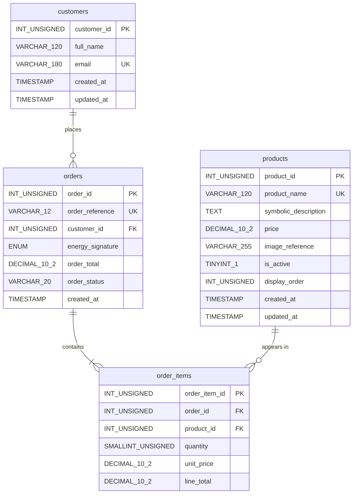

# Hue U Xchange - Database Design

Author: Donavan McFadden

The `hue_u_xchange` database is created by `database/hue_u_xchange.sql`.
It has four InnoDB tables (utf8mb4). The diagram below is generated from
that export and matches the live schema used in final testing.

## Relationships

| Relationship | Foreign key | On update | On delete |
|---|---|---|---|
| One customer has many orders | `orders.customer_id` -> `customers.customer_id` | CASCADE | RESTRICT |
| One order has many order items | `order_items.order_id` -> `orders.order_id` | CASCADE | CASCADE |
| One product appears in many order items | `order_items.product_id` -> `products.product_id` | CASCADE | RESTRICT |

- `RESTRICT` on products keeps order history intact: a product that has
  been ordered cannot be deleted. The application deactivates products
  instead (`is_active = 0`), which hides them from the catalog and cart.
- `CASCADE` on order items means an order's lines are removed with the
  order if an administrator ever deletes it directly in phpMyAdmin.
- `uniq_order_product (order_id, product_id)` allows each product only
  once per order; quantity carries the count.

## Constraints and defaults

- Money columns use `DECIMAL(10,2)`; `CHECK` constraints keep totals and
  prices at 0 or more and quantities between 1 and 25 (the cart limit).
- `customers.email` and `orders.order_reference` are unique.
- `orders.energy_signature` is an optional `ENUM('Flame','Wave','Stone')`.
- `orders.order_status` defaults to `confirmed`; timestamps default to
  `CURRENT_TIMESTAMP`.
- `unit_price` is copied from `products.price` at checkout, so a later
  price change does not rewrite a completed order.

## Seed data

Only the five core offerings are seeded: Divine Hoodie ($44.00), Aura Oils
($22.00), Ritual Kit ($33.00), Music EP ($11.00), and Access Code ($55.00).
The export contains no customer or order rows.
